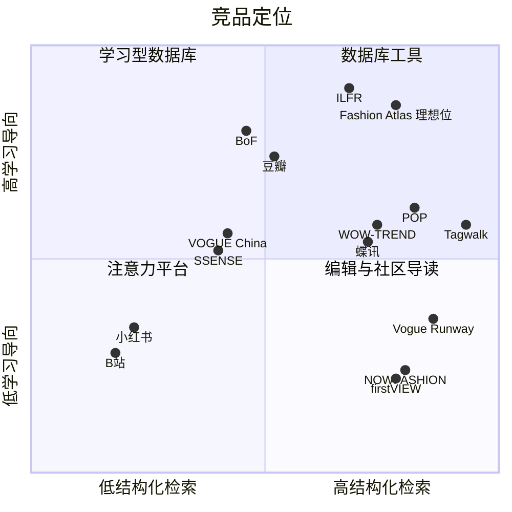
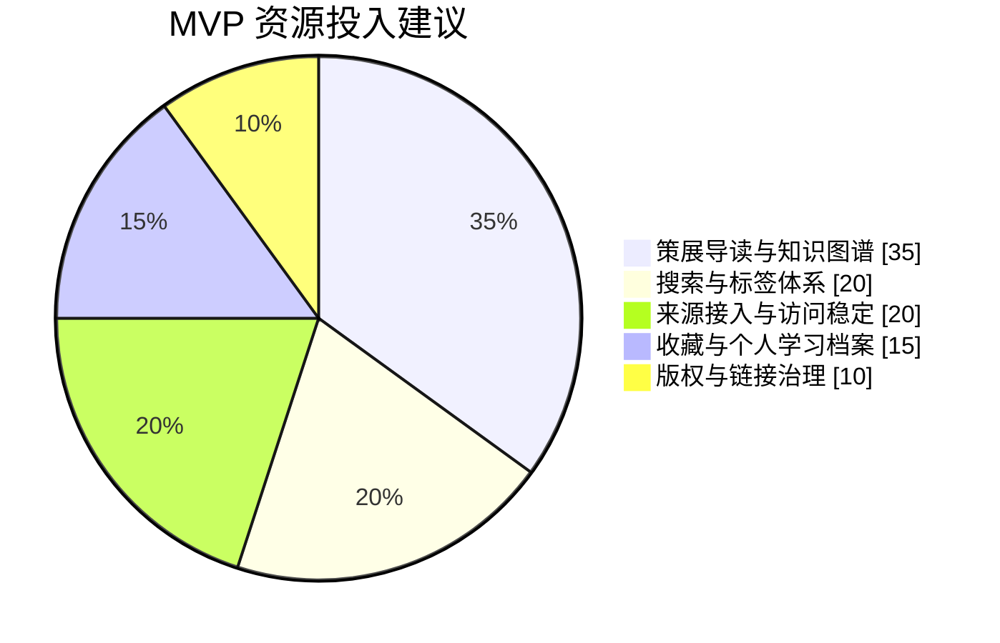
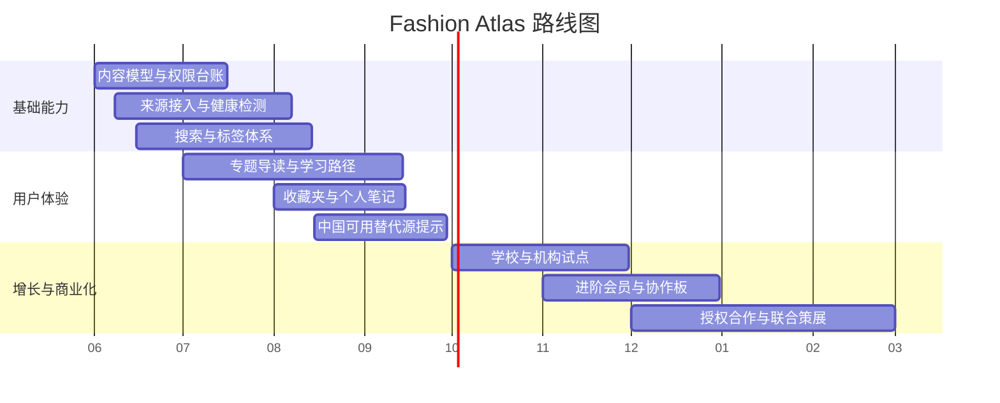

# Fashion Atlas 时尚图谱竞品分析报告

## 执行摘要

从现有供给看，Fashion Atlas 面对的并不是单一竞品，而是四类不同逻辑的产品共同包围的市场：一类是以秀场图片数据库为核心的国际工具，如 Vogue Runway、Tagwalk、firstVIEW、NOWFASHION；一类是以行业趋势、B2B 服务和设计研发为核心的专业平台，如 BoF、POP、WOW-TREND、蝶讯；一类是以注意力分发和社区沉淀为核心的平台，如 B站、小红书、豆瓣；还有一类是以文化编辑、研究馆藏或商业内容为核心的混合型平台，如 SSENSE 与 International Library of Fashion Research。它们各自很强，但都没有同时把“秀场档案、杂志与书籍线索、中文学习导读、跨来源索引、面向中国用户的访问可达性、合规跳转”做成一个统一产品。 citeturn24view1turn35view0turn33view2turn27search1turn11search2turn23search0turn1search1turn15search0turn2search0turn24view9turn33view4turn19view7

因此，Fashion Atlas 最有机会的切入点，不是去正面替代 Vogue Runway 或 Tagwalk 的“专业图片数据库”，也不是去和 POP/WOW-TREND/蝶讯争夺“趋势 SaaS”，更不是做成另一个小红书或 B站；它更应该被定义为一个**中文时尚知识基础设施层**：用策展、索引、学习说明、知识图谱和来源跳转，把分散在全球各处的时尚资料组织成中国用户可理解、可搜索、可收藏、可继续追踪的研究入口。这个定位既避开了头部竞品最重的资产投入区，也回应了中国用户对可达性、中文解释和学习路径的真实痛点。 citeturn24view2turn35view2turn24view4turn14search1turn15search3turn22search5turn24view9turn33view3

核心竞争力应集中在四件事上：第一，做跨媒介结构化索引，把品牌、设计师、系列、城市、年份、杂志、书籍、专题、人物与来源关联起来；第二，做中文导读，而不是只堆砌链接；第三，把“面向中国用户是否容易打开”做成显式数据字段和替代来源机制；第四，把版权与来源治理内置到后台，而不是事后补救。现有竞品里，Tagwalk 的搜索与 moodboard 最强，Vogue Runway 的秀场权威性最强，POP/WOW-TREND/蝶讯 的中文专业落地最强，小红书/B站 的分发最强，豆瓣的列表与个人档案最强，但没有人把这四件事整合起来。 citeturn19view6turn24view1turn23search2turn14search1turn15search5turn22search5turn34view5turn24view9

结论是：**有竞争，但有清晰空位**。前提是产品边界必须非常收敛——不镜像第三方内容，不托管全文大图，不做快讯新闻站，不做开放式 UGC 社区，不承诺解决所有海外访问问题；而是把资源集中在“知识图谱 + 策展导读 + 合规来源卡 + 中国可达性提示 + 个人研究档案”上。只要边界守住，Fashion Atlas 反而比做“大而全时尚门户”更有机会建立壁垒。 citeturn19view2turn4search1turn19view1turn19view7turn22search0turn34view5turn19view3

## 研究范围与方法

本报告覆盖的主要竞品包括：Vogue Runway、VOGUE China、Tagwalk、BoF、POP、WOW-TREND、蝶讯、B站、小红书、豆瓣，以及补充参考的 firstVIEW、NOWFASHION、SSENSE、International Library of Fashion Research。信息优先采用官方官网、官方帮助中心、官方协议与条款、官方 App Store 描述、官方年报或投资者材料；中文官方来源可得时优先使用中文官方来源。个别国际站点对全文抓取有限制时，报告采用官方搜索摘要或可读的官方帮助/条款页，不使用未核实的二手转述。 citeturn12search1turn11search2turn23search0turn1search1turn15search0turn2search0turn22search5turn24view9turn27search1turn33view2turn33view4turn19view7

本报告用统一框架评估竞品，尤其聚焦用户明确关心的九个维度：内容类型是否覆盖秀场档案、杂志与书籍；对中国用户的访问稳定性；中文语言支持；学习与策展能力；搜索与标签体系；个人收藏或 moodboard 能力；商业模式；版权风险；以及这些外部产品对 Fashion Atlas 后台/CMF 的启示。这里的“后台/CMF”按**内容管理框架**理解，即内容模型、来源治理、标签体系、编辑工作流与用户收藏结构。对于“面向中国用户的访问稳定性”，本文采用的是**产品分发形态推断**，依据是否存在中国站、中文站、中国区支付、国内 App/小程序、客户端下载要求等因素进行判断；它不是中国大陆多运营商、分地区的联网测速结论。 citeturn29search3turn35view0turn26search0turn26search1turn24view6turn34view5

为了避免“只比表面功能”，本报告把竞品分成三层：第一层是**直接替代**，即用户会拿它们来完成时尚资料检索、保存与学习任务；第二层是**能力替代**，即某些单项能力特别强，例如 Tagwalk 的结构化搜索、豆瓣的个人档案、小红书的收藏链路；第三层是**参考型竞品**，它们未必与 Fashion Atlas 争夺同一入口，但提供了值得借鉴的模型，如 ILFR 的研究与公共项目、SSENSE 的文化内容与商业协同。 citeturn24view2turn24view9turn34view1turn18search2turn33view4

## 竞品版图与核心画像

当前市场的核心分野，不是“谁内容多”，而是“谁把哪一类内容组织得最有效”。Vogue Runway、firstVIEW、NOWFASHION 更像“专业秀场图片数据库”；Tagwalk 在此基础上进一步把搜索、趋势、分析和 moodboard 工具化；BoF 是“行业媒体与职业 intelligence”；POP、WOW-TREND、蝶讯 是“中国设计研发工具链”；小红书、B站、豆瓣 则分别占据“灵感分发”“视频解释”“个人书影音档案/列表”三个心智位；SSENSE 与 ILFR 则代表“文化内容 + 商业”与“研究馆藏 + 公共项目”两种混合路径。 citeturn24view1turn27search1turn33view2turn24view2turn11search2turn23search0turn1search1turn15search0turn22search5turn2search0turn24view9turn33view4turn19view7

下图以“结构化检索能力”和“学习/策展导向”两条轴对竞品做定位。坐标是基于公开功能的定性判断：例如 Vogue Runway 的品牌/季节/类型/地点过滤与 Tagwalk 的关键词、趋势、moodboard，体现了高结构化；BoF、豆瓣、ILFR 的学习、编辑和研究属性更强；小红书与 B站 则更偏注意力分发与社区消费。 citeturn24view1turn35view1turn19view6turn25search11turn24view9turn33view3turn22search5turn34view5

### 主竞品属性总览

| 竞品 | 产品定位 | 目标用户 | 核心模块 | 内容规模与类型 | 中国访问稳定性 | 版权策略 | 付费模式 | 差异化优劣 | 官方依据 |
|---|---|---|---|---|---|---|---|---|---|
| Vogue Runway | 全球秀场图片档案与 runway 编辑入口 | 时尚编辑、学生、品牌从业者、爱好者 | Image Archive、Latest Shows、Seasons、Designers、Featured；按 Brand/Season/Type/Location 过滤 | 公开页强调可访问“over 1.2 million runway images”；核心是秀场图像与系列条目 | 中低，国际站英文为主；面向中国大陆的稳定性需视网络环境推断 | Condé Nast 商标与内容受保护；镜像与二次分发风险高 | 以开放浏览为主，并与 Vogue 订阅/会员生态联动 | 强在权威秀场档案；弱在中文、本地导读、书刊图谱 | 官网、归档与条款：citeturn24view1turn10search9turn4search0turn4news41 |
| VOGUE China | 中文时尚媒体与杂志官网 | 中国时尚消费者、设计师、编辑、品牌方 | 时装发布、趋势解读、杂志内容、官方小程序、项目活动 | 公开页未披露总量；明确覆盖国际时装发布、潮流趋势与《VOGUE服饰与美容》杂志内容 | 高，有中文官网与官方小程序 | 编辑内容与品牌资产受保护；不适合镜像 | 公开页更像媒体与品牌活动平台，读者付费不突出 | 强在中文与本地话语权；弱在深档案检索与跨源学习地图 | 官网与小程序说明：citeturn12search1turn12search3turn29search3 |
| Tagwalk | 时尚搜索引擎 + 趋势数据平台 | 时尚编辑、买手、设计师、学生、品牌团队 | Collections、Designers、Models、Trends、Moodboards、Reports、Trend Dashboard、Education | 官网教育页给出 500k 已索引/打标图片，覆盖 10+ 年四大时装周档案；公开页同时强调 thousands of fashion shows | 中，有中文界面，但分发仍以国际站和海外 App 为主 | 官网条款明确站内照片受版权保护 | 基础搜索免费；Premium membership、Dashboard、Reports、Education；Dashboard 起价 €2200/月 | 强在搜索/标签/moodboard/教育；弱在书刊资料与中国可达性保证 | 官网、教育页、会员页、仪表盘与条款：citeturn24view2turn35view0turn19view6turn35view2turn4search1 |
| BoF | 全球时尚商业媒体与 intelligence 平台 | 行业管理者、品牌团队、咨询与媒体、求职者 | News & Analysis、BoF Professional、BoF Careers、BoF 500、Company Directory、Reports、Events | 规模未公开；以新闻分析、研究报告、职业市场与行业榜单为主 | 中低，英文为主，会员槛明显 | 官方法律条款约束数字产品使用 | 会员订阅、招聘伙伴订阅、Insights 咨询、活动 | 强在商业分析与职业场景；弱在秀场档案、中文与大众学习导览 | 官网、订阅、职业与产品页：citeturn11search2turn25search2turn25search20turn25search17turn25search12turn25search10 |
| POP | 中国时尚设计资讯与趋势服务平台 | 设计师、服饰企业、趋势研究团队 | 多行业趋势网、色彩/企划/单品趋势书籍、图案素材、设计资讯、App | 公开页未披露内容总量；但平台公开覆盖 130万+设计师、60万+企业，内容横跨服装、鞋、包、家居、珠宝等 | 高，中文站与中国区 App 分发清晰 | 法律声明明确禁止复制、修改、转发、再版、演示或播出，并禁止账号共享 | 会员/VIP、趋势书籍、咨询与活动服务 | 强在中文专业落地和趋势研发；弱在开放传播、学习导读和版权开放度 | 官网、产品服务、法律声明与 App：citeturn23search0turn24view4turn23search2turn19view2turn1search4 |
| WOW-TREND | 中国时尚产业垂直服务平台 | 中国设计师、趋势分析师、品牌商品企划 | 趋势网、发现网、高端趋势书籍、WOW托邦设计、时尚经纬、App、AI 工具 | 公开总量未披露；App 强调全球市场扫描、热门博主精选、T台/品牌/零售/街拍/工艺等多维内容 | 高，中文站与国内分发明确 | 公开版权细则披露较少，但整体为专业服务平台，镜像风险应高估 | 以专业服务与订阅为主，公开标准价未见突出 | 强在中国市场语境、社媒与趋势拼接；弱在公开深档案与规则透明度 | 官网与 App：citeturn1search1turn14search1turn14search3turn14search13 |
| 蝶讯 | 时尚趋势预测与设计服务平台 | 设计师、买手、品牌研发团队 | 客户端登录、VIP 账号、时尚头条、趋势资讯、学院、博主、色彩实验室；公开说明覆盖时装发布、街拍、品牌分析、趋势书籍、图案工艺等 | 公开总量未披露；公开说明可见 13 栏目/多板块结构 | 高，但技术上依赖客户端与 VIP 账号 | 会员制、客户端访问与权限控制意味着权利边界较严 | VIP/试用为主 | 强在专业广度与工具化；弱在公开发现性、跨端轻量化与开放索引 | 官方下载、帮助与 App，辅以公开接入说明：citeturn15search0turn24view6turn15search3turn15search5 |
| 小红书 | 生活兴趣社区 + 搜索种草 + 电商 | 年轻消费者、时尚爱好者、品牌、创作者 | 浏览与搜索、笔记、直播、电商、收藏专辑、专业号、聚光广告 | 规模未在这些官方页集中披露；核心是海量图文/视频笔记与搜索流量 | 高，中文本地平台 | 用户协议、社区规范与权利保护中心都强调知识产权与投诉机制，外部抓取风险高 | 广告、专业号、电商、内容转化 | 强在分发、搜索与灵感心智；弱在结构化知识、长线学习与可信度分层 | 官方协议、商业平台与收藏/专辑说明：citeturn22search5turn22search0turn22search1turn22search4turn34view1 |
| 豆瓣 | 文化资料库与兴趣社区 | 读者、影迷、乐迷、文化青年、研究者 | 书影音资料库、评分评论、榜单、片单/书单、小组、个人档案、豆瓣时间、豆品、书店 | 官方 App 描述强调“丰富庞大的书影音资料库”；列表、标记与精神档案是核心 | 高，中文本地平台 | 协议明确平台内容与用户发布内容的知识产权安排，并提供侵权投诉流程 | 内容付费、书店、电商等 | 强在列表、标记、个人档案与社区讨论；弱在时尚专业结构与秀场深度 | 官方 App、协议与投诉指引：citeturn24view9turn19view3turn34view7turn6search11 |
| B站 | 视频社区与内容消费平台 | 大众用户、创作者、学习型观众、品牌主 | 视频、搜索、评论、收藏夹、历史、投稿、直播、大会员 | 公开页未披露具体体量；核心是海量 UGC/PUGC 视频与视频化解释 | 高，中文本地平台 | 官方明确有版权申诉流程，且对自制与授权独占内容拥有完整知识产权；对外抓取复用风险高 | 广告、直播、会员、游戏、其他增值服务 | 强在视频解释与传播；弱在时尚资料的结构化、去噪和研究型沉淀 | 关于页、侵权申诉与官方年报：citeturn2search0turn34view5turn31view0turn32view1 |

*表中的“中国访问稳定性”是基于官网语言、本地化、中国区支付/App/小程序/客户端下载要求的产品推断，不是中国大陆网络实测结论。*

### 参考型竞品属性总览

| 竞品 | 产品定位 | 核心价值 | 对 Fashion Atlas 的启发 | 官方依据 |
|---|---|---|---|---|
| firstVIEW | 老牌秀场图片数据库 | 官网强调其是最早的 runway fashion site and database，累积 800万+ 照片与数百视频，并支持按设计师与日期浏览女装/男装系列 | 说明“时间序列化秀场浏览”仍有价值，但也暴露出纯图片库在学习导读与现代交互层面的不足 | 官网搜索摘要：citeturn27search1turn27search2 |
| NOWFASHION | 秀场图像数据库 + 图片售卖 | 官网把自己定义成“the world’s largest fashion show runway image database”，提供 schedule、seasons、逐场图片和 licensing 入口 | 说明“快图、授权、销售”是一条清晰路径，但并不等于知识型产品 | 官网与联系页：citeturn33view2turn17search6 |
| SSENSE | 文化内容与奢侈品电商平台 | 兼具 Editorial Archive、内容生产、愿望清单、电商与中国区中文站/支付宝 | 说明“内容 + 交易 + 收藏”可以共存，但 Fashion Atlas 不应在 MVP 阶段卷入库存与履约 | 官网、中文站与条款：citeturn33view4turn26search0turn26search1turn19view1turn26search5 |
| ILFR | 时尚印刷品研究图书馆 | 覆盖 books、magazines、catalogs、press releases、show invitations 等，并用 editorial、public program、request stack 组织研究体验 | 说明“书刊与 ephemeral print matter”完全可以成为时尚产品的核心，但数字复制权限必须高度谨慎 | 官网 About、首页与 Program：citeturn19view7turn33view3turn18search0turn18search2 |

## 功能与商业模式对比

如果只看“找到一张秀图”，Vogue Runway、Tagwalk、firstVIEW、NOWFASHION 已经很成熟；如果只看“从中国市场做趋势研发”，POP、WOW-TREND、蝶讯 足够强；如果只看“内容分发”，小红书和 B站 的注意力效率更高；如果只看“个人档案”，豆瓣的标记和片单/书单模型已经验证了长期记录价值。Fashion Atlas 只有在**功能组合方式**上做出明显不同，才有独立成立的产品理由。 citeturn24view1turn35view0turn33view2turn24view4turn14search1turn15search5turn22search5turn34view5turn24view9

从功能层看，“搜索/标签”和“个人收藏”是最需要拆开研究的两个维度。Tagwalk 的标签、趋势和 moodboard 是目前最接近 Fashion Atlas 理想工作流的外部样本；但它的对象仍以 runway imagery 为主。豆瓣、小红书、B站 各自具备片单/书单、专辑/收藏、收藏夹等能力，却没有跨来源的统一 fashion schema。正因为两类能力分散在不同产品里，Fashion Atlas 反而有机会做成“跨源研究档案层”。 citeturn35view0turn19view6turn24view9turn34view1turn34view5

### 关键功能矩阵

说明：`◎` 为核心能力，`○` 为可用但非主核，`△` 为有限或公开页未突出，`—` 为非核心或未见公开支持。

| 竞品 | 秀场档案 | 杂志 | 书籍 | 中文支持 | 学习/策展 | 搜索/标签 | 收藏/Board | 商业模式清晰度 | 对 Fashion Atlas 后台/CMF 的启示 | 依据 |
|---|---|---:|---:|---:|---:|---:|---:|---:|---|---|
| Vogue Runway | ◎ | △ | — | △ | ○ | ◎ | △ | ○ | 需要强 show entity、四级过滤和时间轴 | 归档与官网：citeturn24view1turn10search9 |
| VOGUE China | ○ | ◎ | △ | ◎ | ○ | △ | △ | △ | 需要编辑专题、项目页与本地化栏目体系 | 官网与小程序：citeturn12search1turn29search3 |
| Tagwalk | ◎ | — | — | ○ | ○ | ◎ | ◎ | ◎ | 需要细粒度标签库、moodboard、教育模板 | 官网、教育与会员：citeturn35view0turn35view2turn19view6 |
| BoF | △ | △ | △ | — | ◎ | ○ | △ | ◎ | 需要报告/主题综述/职业与行业视角的专题模板 | 官网与产品页：citeturn11search2turn25search17turn25search20 |
| POP | ○ | ◎ | △ | ◎ | ○ | ○ | △ | ◎ | 需要 trend taxonomy 与中国研发场景字段 | 官网与产品说明：citeturn24view4turn23search2turn1search4 |
| WOW-TREND | ○ | ◎ | △ | ◎ | ○ | ○ | △ | ○ | 需要“趋势 + 社媒精选 + 设计动作”混合卡片模型 | 官网与 App：citeturn14search1turn14search3 |
| 蝶讯 | ○ | ○ | ○ | ◎ | ○ | ○ | △ | ◎ | 需要客户端/权限/栏目级访问控制字段 | 官方帮助与 App：citeturn24view6turn15search3turn15search5 |
| 小红书 | △ | △ | △ | ◎ | △ | ○ | ◎ | ◎ | 需要 board/收藏专辑模型，但必须去平台化依赖 | 协议、聚光与 deeplink：citeturn22search5turn34view1turn28search4 |
| 豆瓣 | — | △ | ◎ | ◎ | ◎ | ○ | ◎ | ○ | 需要“列表 + 标记 + 个人档案”持久化结构 | App、协议与片单/书单场景：citeturn24view9turn19view3turn28search3 |
| B站 | △ | — | — | ◎ | ○ | ○ | ○ | ◎ | 需要视频型资料卡，但不能被视频流吞没 | 申诉页、导航与年报：citeturn34view5turn31view0turn32view1 |
| firstVIEW | ◎ | — | — | — | △ | ○ | △ | △ | 需要支持按设计师/日期的低摩擦浏览 | 官网摘要：citeturn27search1turn27search2 |
| NOWFASHION | ◎ | — | — | — | △ | ○ | △ | ◎ | 需要为图片授权类来源单独建 rights class | 官网：citeturn33view2 |
| SSENSE | △ | ○ | △ | ◎ | ○ | ○ | ○ | ◎ | 需要内容卡与商品/品牌卡解耦，支持愿望清单式收藏 | 官网、中文站与条款：citeturn33view4turn26search0turn26search5 |
| ILFR | △ | ◎ | ◎ | — | ◎ | ○ | ○ | ○ | 需要 publication entity、request stack 与 public program 逻辑 | 官网 About、首页与 Stack：citeturn19view7turn33view3turn18search0 |

### 版权、可达性与个体研究能力的三个关键判断

第一，**版权风险是产品边界，而不是法务尾活**。POP 明确禁止复制、修改、转发、再版和账号共享；Tagwalk 明确写明站内照片受版权保护；SSENSE 的站内内容和 editorial publication 不得未经书面许可复制传播；ILFR 更明确禁止存储、索引、分发和复制站内内容；小红书、B站、豆瓣 则都建立了侵权投诉机制并要求用户具备相应权利或授权。对 Fashion Atlas 来说，这意味着“本地镜像大图/全文”基本不可行，推荐路线必须是**标准化 metadata + 中文说明 + deep link + 受控缩略信息**。 citeturn19view2turn4search1turn26search5turn19view7turn22search1turn34view5turn34view7

第二，**面向中国用户的可达性仍有明显分层**。国内平台和中文专业工具天然更稳；SSENSE 是海外参考对象中少数同时提供中文站、中国区购物与支付宝能力的产品；Tagwalk 虽有中文界面，但核心仍是国际站和海外 App 逻辑；Vogue Runway、BoF、firstVIEW、NOWFASHION、ILFR 公开形态仍主要是国际英文站，蝶讯则在技术层面需要客户端下载和 VIP 账号。Fashion Atlas 如若把“来源可达性”做成显式字段与筛选器，本身就能形成独立价值。 citeturn26search0turn26search1turn35view2turn24view1turn11search2turn27search1turn33view2turn19view7turn24view6

第三，**个人研究档案仍然是空白机会**。Tagwalk 的 moodboards 很强，但只服务于其自有 runway 数据场；小红书的收藏专辑围绕平台内容；豆瓣的标记、榜单和片单/书单形成了长期兴趣档案；B站 的收藏夹服务于视频消费。换言之，现有产品都验证了“收藏不是附属功能”，但还没有谁把它做成一个跨来源、跨对象、面向时尚研究的学习档案层。Fashion Atlas 可以把收藏对象从“内容帖子”提升为“来源卡、品牌、系列、杂志期号、书籍、术语、专题”。 citeturn19view6turn34view1turn24view9turn34view5

## SWOT 与机会缺口

下表中的优势与劣势主要依据公开功能和官方说明；机会与威胁则是基于市场结构做出的产品判断。对于 Fashion Atlas，真正值得重点防守的不是某一家平台，而是“多家平台拼在一起之后”的合成竞争。 citeturn24view1turn35view0turn11search2turn24view4turn14search1turn15search3turn22search5turn24view9turn34view5

### 主要竞品 SWOT 摘要

| 竞品 | Strengths | Weaknesses | Opportunities | Threats | 依据 |
|---|---|---|---|---|---|
| Vogue Runway | 权威秀场档案；过滤清晰；图片量极大 | 中文弱；书刊弱；学习路径不成体系 | 可继续向深层 archive 和会员价值延伸 | 被 Tagwalk 的工具化搜索和 Fashion Atlas 的中文导读切走研究型用户 | citeturn24view1turn10search9turn4news41 |
| VOGUE China | 中文媒体影响力强；本地项目能力强 | 深档案能力弱；结构化不强 | 可继续做中国设计师与本地时尚教育 | 被更系统的知识型产品夺走“学习入口” | citeturn12search1turn29search3 |
| Tagwalk | 搜索标签最强；moodboard 成熟；教育产品清晰 | 图像中心化；书刊弱；中国稳定性非其主卖点 | 向教育、数据洞察、品牌分析继续扩展 | 被 Vogue Runway 的权威档案和本产品的中文跨媒介索引分流 | citeturn35view0turn35view2turn19view6 |
| BoF | 商业 intelligence 与职业场景强；产品矩阵成熟 | 不是秀场数据库；中文弱；普通爱好者门槛高 | 继续做行业标准与组织级订阅 | 被更垂直、更轻量的学习产品抢走初阶与学生用户 | citeturn11search2turn25search2turn25search20 |
| POP | 中国设计研发语境强；趋势/书籍/图案体系深 | 权限封闭；开放传播弱；学习解释不够大众 | 继续深化 B2B 与产业集群服务 | 被更轻量、跨来源、学习型工具切走个人研究用户 | citeturn23search0turn24view4turn19view2 |
| WOW-TREND | 趋势与社媒精选结合；中国市场导向明确 | 公开规则和数据深度透明度较有限 | 扩大 AI 设计与趋势协作场景 | 被更强的结构化索引与长期档案工具超越 | citeturn14search1turn14search3turn14search13 |
| 蝶讯 | 专业广度强；客户端 + VIP 体系清晰；带学院和工具 | 公共可见性弱；轻量 Web 体验弱 | 继续做专业工具链和企业服务 | 被轻量化、链接型、学习导览型产品切走入口层 | citeturn24view6turn15search3turn15search5 |
| 小红书 | 搜索种草与收藏习惯强；品牌商业化成熟 | 知识噪音高；结构化差；版权外部复用敏感 | 继续吃时尚灵感与品牌营销预算 | 被“可信来源 + 中文导读”型产品切走高意图学习用户 | citeturn22search5turn22search0turn34view1 |
| 豆瓣 | 片单/书单/标记/档案机制强；社区讨论深 | 时尚专业对象不足；秀场弱 | 向时尚书单、设计文献社群自然延展 | 被更垂直专业的 Fashion Atlas 抢走时尚兴趣节点 | citeturn24view9turn19view3turn28search3 |
| B站 | 视频解释力强；搜索与收藏使用习惯成熟 | 研究沉淀弱；结构化弱；版权压力高 | 继续承接时尚知识视频化 | 被知识图谱型产品拿走“找资料”而非“看视频”场景 | citeturn34view5turn31view0turn32view1 |

### 市场空白分析

| 空白机会 | 现有竞品为什么没有填满 | 对 Fashion Atlas 的意义 | 优先级 |
|---|---|---|---|
| 跨媒介知识图谱 | Vogue Runway/Tagwalk/firstVIEW/NOWFASHION 强在秀场；ILFR 强在书刊与印刷物；豆瓣强在书影音与列表；但没有一个产品同时把 show、magazine、book、editorial、topic 连成中文图谱 | 这是最核心的差异化基础，应优先建立 canonical entities | 极高 |
| 中国访问友好导航 | 海外站点普遍不是为中国用户访问路径设计；国内专业工具又常需要客户端、会员或更封闭的工作流 | “可打开/不好打开/替代源”本身就是用户价值，而不只是技术信息 | 极高 |
| 中文学习导读 | Tagwalk 有教育页但主要面向专业学校和 runway 研究；BoF 更偏商业管理；VOGUE China 偏媒体栏目；ILFR 偏研究项目 | 可做“入门路径、术语解释、专题地图、关联阅读” | 极高 |
| 跨来源个人研究档案 | Tagwalk 的 moodboard、豆瓣的片单/书单、小红书的收藏专辑、B站 的收藏夹都存在，但彼此割裂 | 可把“收藏”升级为研究档案与长期复习工具 | 高 |
| 合规索引后台 | 多数站点强调版权与投诉机制，但没有面向第三方策展者的权利台账与可达性治理层 | 后台做得好，才有持续可运营性和商业合作空间 | 极高 |

上述空白说明，Fashion Atlas 的“产品竞争性”并不来自自有内容量，而来自**跨来源组织能力、中文解释能力、可达性治理能力和长期档案能力**。这四者叠加起来，才是与现有竞品真正错位的地方。 citeturn24view1turn35view0turn33view2turn19view7turn24view9turn34view1turn34view5

## Fashion Atlas 差异化与产品边界

Fashion Atlas 最合理的定义，不是“时尚门户站”，而是**中文时尚知识图谱与策展导览平台**。它的主任务不是制造更多内容，而是降低用户进入时尚世界的检索成本、理解成本与访问成本：告诉用户“这是什么、为什么重要、和什么有关、去哪里看原始来源、哪些来源在中国更稳、你应该把它放进自己的哪一个研究篮子里”。这一定义既能对接学生、自学者、初级从业者，也能服务中高阶用户搭建自己的参考档案。 citeturn35view0turn24view9turn19view7turn22search5

### 建议坚持的产品边界

| 应该做 | 不应该做 |
|---|---|
| 做来源卡、系列卡、杂志卡、书籍卡、术语卡与专题导读 | 不托管第三方全文、大图、整本期刊 PDF 或视频镜像 |
| 做中文学习说明、时间线、关联阅读路径 | 不做快讯型新闻媒体，不追 24 小时资讯竞争 |
| 做跨来源收藏夹、研究笔记、复习档案 | 不在 MVP 阶段做开放式 UGC 社区 |
| 做中国可达性提示、替代来源推荐、链接健康检查 | 不承诺绕开地域限制、付费墙或技术封锁 |
| 做机构合作接入、授权专题、课程包 | 不做未授权大规模抓取、转载与二次分发 |

之所以必须这么收边界，是因为外部内容权利约束非常强：POP、Tagwalk、SSENSE、ILFR 都对复制、传播、索引或再利用设有明显限制，UGC 平台也都保留投诉和维权机制。Fashion Atlas 只有从一开始就把自己定义成**索引层与说明层**，才既能活下来，也更容易谈后续合作。 citeturn19view2turn4search1turn26search5turn19view7turn22search1turn34view5turn34view7

### 后台与 CMF 需求

| 模块 | 最小字段集 | 为什么必须做 | 外部信号 |
|---|---|---|---|
| 实体模型 | Brand、Designer、Show、Season、City、Type、Look、Publication、Issue、Book、Source、Topic | 没有规范实体，就无法把“秀场—杂志—书籍—专题”连起来 | Vogue Runway 的 Brand/Season/Type/Location 过滤、NOWFASHION 的 Seasons/Schedules、ILFR 的 Brand/Publisher/Year/Category、豆瓣的书影音资料库都说明实体化是基础。 citeturn24view1turn33view2turn33view3turn24view9 |
| 标签体系 | Color、Fabric、Silhouette、Material、Detail、Theme、Craft、Occasion、Region、Language | 时尚内容不靠全文搜索就能搜准，关键是高质量 controlled vocabulary | Tagwalk 的教育页和 Dashboard 已把 color/fabric/silhouette/theme 做成主轴，POP 的 T 台分析和趋势书籍也围绕色彩、廓形、图案、工艺、面料组织。 citeturn35view0turn35view2turn24view4turn23search2 |
| 来源治理 | source_url、source_owner、rights_class、paywall_flag、client_required、region_access、alt_source、last_checked | Fashion Atlas 的生死点在于“能否合法、长期、稳定地跳转” | POP 法律声明、蝶讯客户端/VIP、SSENSE 中文站/支付宝、NOWFASHION licensing、ILFR legal 都说明来源状态必须管理。 citeturn19view2turn24view6turn26search1turn33view2turn19view7 |
| 编辑工作流 | Draft、Review、Legal Check、Publish、Update、Archive；每条卡片对应策展说明与术语解释 | 产品不是单纯聚合器，而是“带说明的索引” | ILFR 的 editorial/public program、BoF 的 special editions 与报告、VOGUE China 的项目页都说明高质量解释层必须有编辑流。 citeturn18search2turn25search19turn29search3 |
| 用户研究档案 | Collection、Board、Folder、Note、Tag、Citation、Source Snapshot | 收藏不是附属品，而是学习闭环 | Tagwalk moodboards、小红书专辑/收藏、豆瓣标记与榜单、B站 收藏夹都验证了用户需要长期存档。 citeturn19view6turn34view1turn24view9turn34view5 |
| 本地化层 | 中文标题、中文摘要、术语双语表、难词解释、来源可达性提示 | 这是你与国际站最核心的差异化来源 | Tagwalk 有中文界面、SSENSE 有中文站、VOGUE China 有小程序，但大量国际内容仍缺系统中文解释。 citeturn35view2turn26search0turn29search3 |
| 机构协作层 | School Account、Syllabus、Shared Board、Curator Page、Partner Source | 长期商业化更可能来自学校、研究机构与品牌合作，而不是广告流量 | Tagwalk for Education、BoF Careers/Professional、ILFR 的教育合作和商业合作都证明机构层是可行方向。 citeturn35view0turn25search20turn19view7 |

### 推荐差异化抓手

| 抓手 | 为什么能形成壁垒 |
|---|---|
| 中文时尚知识图谱 | 不是简单翻译，而是把“时装秀—品牌—设计师—书刊—术语—专题”做成可导航网络 |
| 学习导读 | 海量秀图和信息并不自动构成知识；真正稀缺的是“怎么读、先看什么、为什么值得看” |
| 中国可达性层 | 对中国用户而言，“能否打开”本身就是体验的一部分，现有国际竞品大多没有把它产品化 |
| 合规来源台账 | 竞品普遍权利强势，谁先把 rights/admin 做好，谁更能长期运营和谈合作 |
| 跨来源研究档案 | 现有收藏功能都困在各自平台里，Fashion Atlas 可以做用户自己的时尚知识工作台 |

## MVP 建议、路线图与 KPI

MVP 不应追求“大而全”，而应追求“第一版就形成不可替代的工作流”。最小可行闭环应是：**发现一个对象 → 读懂它 → 跳到可靠来源 → 收藏进自己的研究档案 → 未来还能再次找到它**。围绕这个闭环，最先上线的不是海量内容，而是高质量的卡片模型、稳定搜索、专题导读与收藏笔记。这个顺序比“先做社区”更稳，也比“先做内容堆量”更有复利。 citeturn35view0turn24view9turn19view7turn22search5

### MVP 资源投入建议

### 建议的 MVP 功能集

| 优先级 | 功能 | 用户价值 | 关键依赖 | 明确不做 |
|---|---|---|---|---|
| 最高 | 来源卡与对象卡 | 用户能快速知道“是什么、去哪里看、能不能打开” | 实体模型、来源治理 | 不存原始大图与全文 |
| 最高 | 搜索与过滤 | 按品牌、设计师、季节、城市、媒介类型、主题标签查找 | taxonomy、索引、搜索引擎 | 不追求复杂推荐算法先行 |
| 最高 | 专题导读 | 把“看秀、看杂志、看书”组织成学习路径 | 编辑模板、术语表 | 不做日更资讯流 |
| 高 | 收藏夹与研究笔记 | 形成回访和长期价值 | 用户系统、Board/Folder 模型 | 不做开放社交 feed |
| 高 | 中国可达性提示 | 解决“想看却打不开”的挫败 | 来源状态字段、替代源建议 | 不承诺技术翻墙式方案 |
| 高 | 权利与链接后台 | 降低侵权和失效链接风险 | rights ledger、审校流 | 不在前台展示复杂法务术语 |
| 中 | 机构专题页 | 为学校/工作室/课程合作做准备 | 多用户协作、权限 | 不在 MVP 做复杂 CRM |
| 中 | 轻量化会员能力 | 先验证付费意愿 | 收藏上限、导出、协作版 | 不先做广告系统 |

### 路线图

### 分阶段行动清单

| 时间窗 | 应完成的动作 | 交付标准 |
|---|---|---|
| 前期阶段 | 建立 canonical entity schema；完成 300 个品牌、1000 个 show/source 卡片；上线中文术语表、基础搜索、来源状态字段；完成首批 30 个专题导读 | 用户可完成“检索—理解—跳转—收藏”闭环；后台可追踪来源状态与版权类别 |
| 增长阶段 | 增加杂志/书籍/专题对象；上线收藏夹、笔记、board；加入中国可达性提示与替代源建议；启动 3 个学校或工作室试点 | 收藏行为与回访开始显著提升；机构用户愿意使用课堂/研究场景 |
| 年度阶段 | 补齐更多 print matter、书单、专题时间线；上线协作板、导出、轻会员；尝试授权联合策展与机构包 | 平台形成稳定复访与初步收入模型，且合规事件可控 |

### 风险与缓释

| 风险 | 影响 | 概率 | 缓释方案 | 依据 |
|---|---|---|---|---|
| 第三方版权投诉 | 极高 | 高 | 默认不镜像原内容；只存必要 metadata；对缩略图、摘要和封面建立 rights class；上线投诉/下架流程 | POP、Tagwalk、SSENSE、ILFR、B站、小红书、豆瓣均有明显版权与投诉机制。 citeturn19view2turn4search1turn26search5turn19view7turn34view5turn22search1turn34view7 |
| 海外来源对中国用户不稳定 | 高 | 中高 | 对每个来源建 `region_access` 字段；提供替代来源建议；前台显式提示“国际站/需客户端/需会员/可中国区访问” | SSENSE 已做中国区本地化，而 Vogue Runway、BoF、firstVIEW、NOWFASHION、ILFR 仍主要是国际站；蝶讯则依赖客户端。 citeturn26search0turn24view1turn11search2turn27search1turn33view2turn19view7turn24view6 |
| 编辑工作量过大 | 高 | 中 | 用模板化卡片、受控词表与批量导入降低人工；先做“少而精”的专题而非一开始堆海量 | Tagwalk、BoF、ILFR 的高质量解释层都建立在明确结构与流程上。 citeturn35view0turn25search19turn18search2 |
| 用户感知“只是链接导航” | 中高 | 中 | 强化中文导读、对比专题、术语表与个人研究档案，提升非链接部分价值 | 现有强平台大多已有分发或收藏能力，Fashion Atlas 必须把“理解成本降低”做成主卖点。 citeturn22search5turn24view9turn34view5 |
| 过早商业化损伤口碑 | 中 | 中 | MVP 阶段不插重广告，优先做机构试点与进阶会员，保持工具属性 | Tagwalk、BoF、SSENSE、豆瓣都说明成熟商业模式往往建立在清晰产品价值之后。 citeturn19view6turn25search2turn33view4turn30search6 |

### KPI 体系

| KPI | 定义 | 前期目标 | 增长期目标 | 年度目标 |
|---|---|---:|---:|---:|
| 有效内容覆盖数 | 完成结构化入库并通过审校的对象卡总数 | 2,000 | 10,000 | 30,000 |
| 主题导读完成数 | 可独立阅读的专题、学习路径数量 | 30 | 150 | 400 |
| 搜索成功率 | 搜索后点击结果或继续筛选的会话占比 | 65% | 75% | 82% |
| 零结果率 | 搜索无结果占比 | <25% | <15% | <10% |
| 来源点击率 | 对外跳转点击 / 详情页浏览 | 20% | 28% | 35% |
| 收藏率 | 详情页触发收藏或加入 board 的占比 | 8% | 15% | 22% |
| 回访率 | 30 天内至少回访一次的用户占比 | 20% | 32% | 45% |
| 笔记渗透率 | 有收藏行为用户中写过至少一条笔记的占比 | 12% | 20% | 30% |
| 中国可达性覆盖率 | 带 region_access 字段与替代源提示的卡片占比 | 70% | 85% | 95% |
| 链接健康度 | 最近 30 天可正常跳转来源的链接占比 | 92% | 95% | 97% |
| 合规事件数 | 有效侵权投诉或下架事件 | 0 容忍 | ≤2/季度 | ≤4/年且可复盘 |
| 机构试点数 | 学校/工作室/研究机构试点账号数 | 1 | 3 | 10 |

综合来看，Fashion Atlas 的正确打法不是“做最大”，而是“做最像一张中文时尚研究地图”。一旦把**知识图谱、导读层、可达性层、合规层、研究档案层**做稳，它就不会只是一堆链接，而会成为一套比现有竞品更适合中国用户学习和研究时尚的工作流。 citeturn24view1turn35view0turn24view9turn19view7turn26search0turn19view2